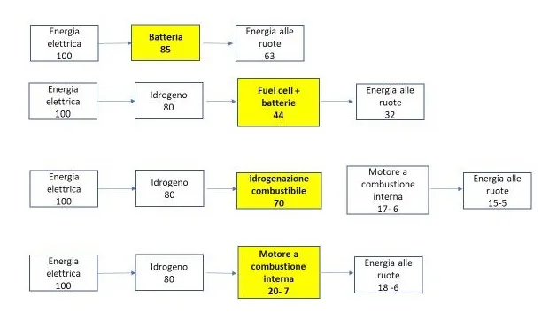

# Risposte frequenti ai dubbi sulle Auto Elettriche

Ciao a tutti,
in questa semplice pagina vogliamo raccogliere tutte le domande più frequenti, e le rispettive risposte, sulle auto elettriche.

Luca

### Efficienza

1. **E le auto a idrogeno? Anche queste sono una soluzione.**

Vero, sono una soluzione, ma nella migliore dell'ipotesi hanno un'efficienza che è la metà di quella delle auto elettriche.

(Fonte: https://sostenibilitaequitasolidarieta.it/diamo-i-numeri-sullidrogeno/)
